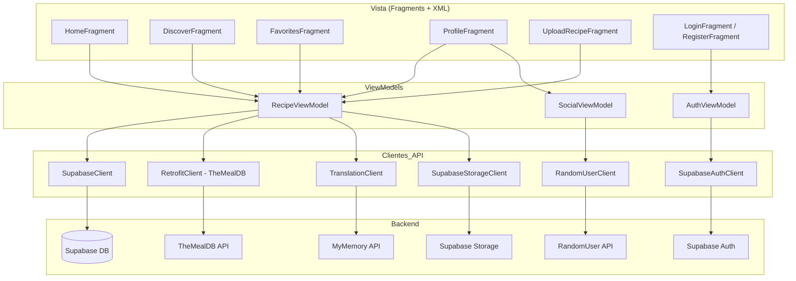
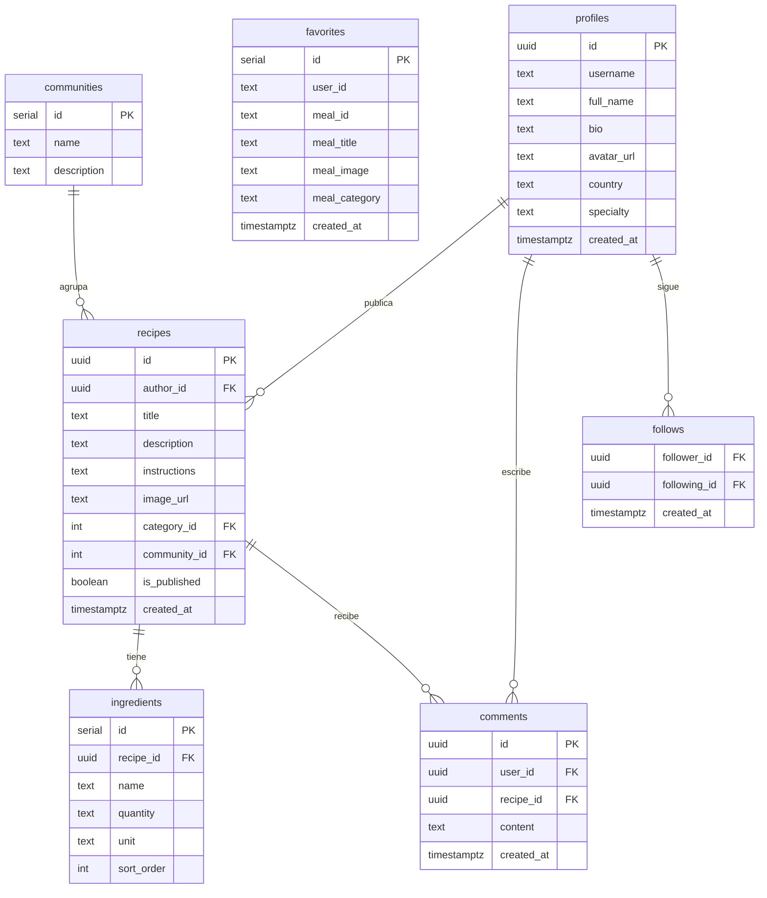
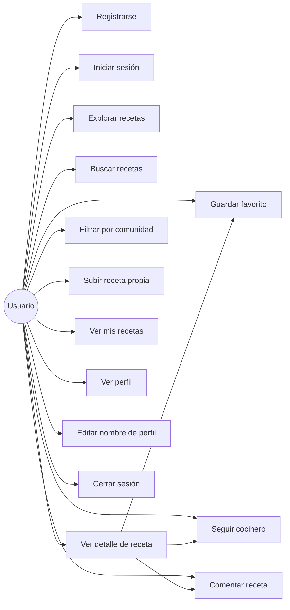
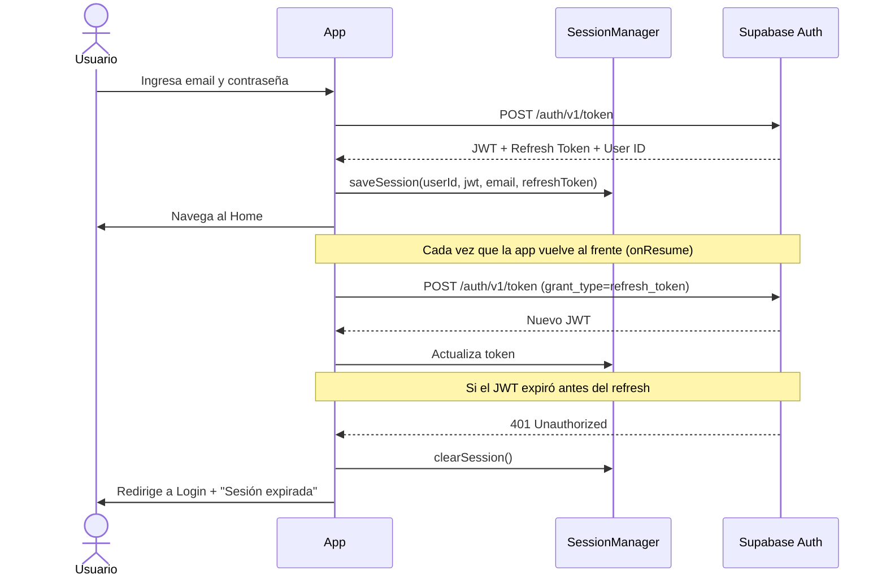
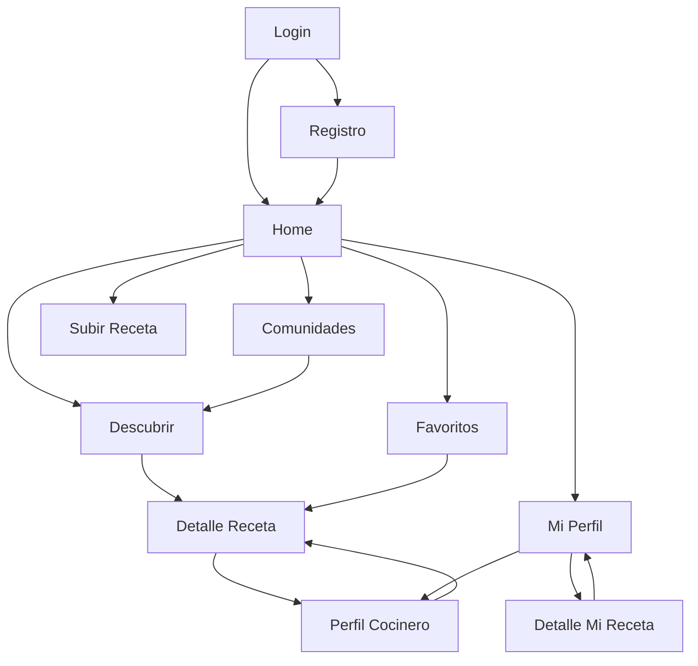

# CreeshApp — Guía Completa del Proyecto

> Documentación técnica completa de la aplicación. Cubre concepto, arquitectura, frontend y backend.

---

## ¿Qué es CreeshApp?

CreeshApp es una aplicación móvil Android para descubrir, guardar y compartir recetas de cocina. Los usuarios pueden explorar miles de recetas internacionales, guardar sus favoritas, seguir a cocineros, publicar sus propias recetas y participar en comunidades temáticas.

**Stack tecnológico:**
- **Frontend:** Android (Kotlin), arquitectura MVVM
- **Backend:** Supabase (PostgreSQL + Auth + Storage)
- **APIs externas:** TheMealDB (recetas), RandomUser (cocineros), MyMemory (traducción)

---

## Diagramas

### 1. Arquitectura MVVM



---

### 2. Diagrama Entidad-Relación (Base de datos)



---

### 3. Casos de Uso



---

### 4. Flujo de Autenticación



---

### 5. Navegación entre Pantallas



---

## Estructura del Proyecto

```
CreeshApp/
├── app/src/main/java/com/creesh/app/
│   ├── adapters/          # Adaptadores para RecyclerViews
│   │   ├── ChefAdapter
│   │   ├── CommentAdapter
│   │   ├── FavoriteAdapter
│   │   ├── MyRecipeAdapter
│   │   ├── RecipeAdapter / RecipeHorizontalAdapter
│   │   └── CommunityAdapter
│   ├── api/               # Clientes HTTP y APIs
│   │   ├── SupabaseClient          (REST API principal)
│   │   ├── SupabaseAuthClient      (Autenticación)
│   │   ├── SupabaseStorageClient   (Subida de imágenes)
│   │   ├── RetrofitClient          (TheMealDB)
│   │   ├── TranslationClient       (MyMemory)
│   │   ├── RandomUserClient        (Cocineros)
│   │   └── models/                 (Data classes)
│   ├── fragments/         # Pantallas de la app
│   │   ├── LoginFragment / RegisterFragment
│   │   ├── HomeFragment
│   │   ├── DiscoverFragment
│   │   ├── FavoritesFragment
│   │   ├── ProfileFragment
│   │   ├── UploadRecipeFragment
│   │   ├── RecipeDetailFragment
│   │   ├── MyRecipeDetailFragment
│   │   ├── ChefProfileFragment
│   │   └── CommunitiesFragment
│   ├── viewmodel/         # Lógica de negocio (MVVM)
│   │   ├── RecipeViewModel   (recetas, favoritos, traducción)
│   │   ├── AuthViewModel     (login, registro)
│   │   └── SocialViewModel   (cocineros, follows)
│   └── utils/
│       └── SessionManager    (tokens, datos de sesión)
├── app/src/main/res/
│   ├── layout/            # Interfaces XML
│   └── navigation/        # Grafo de navegación
└── database/
    └── schema.sql         # Esquema completo de Supabase
```

---

## Flujo completo de una receta

1. Usuario abre la app → JWT se refresca automáticamente
2. `HomeFragment` carga una receta destacada desde TheMealDB
3. Usuario presiona "Descubrir" → `DiscoverFragment` carga recetas aleatorias
4. Usuario toca una receta → `RecipeDetailFragment` muestra el detalle
5. TheMealDB devuelve el contenido en inglés → `TranslationClient` lo traduce al español
6. Usuario toca ❤️ → `RecipeViewModel.toggleFavorite()` → POST a Supabase `favorites`
7. Favorito queda guardado permanentemente en la base de datos

---

## Seguridad

- Contraseñas manejadas exclusivamente por Supabase Auth (nunca se almacenan en la app)
- JWT guardado en SharedPreferences, nunca en texto visible
- Row Level Security (RLS) en todas las tablas: cada usuario solo accede a sus propios datos
- Timeout de sesión por inactividad (30 minutos)
- Refresh automático del token para mantener la sesión activa
