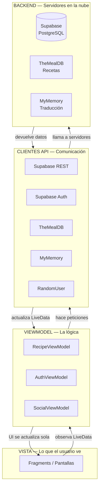
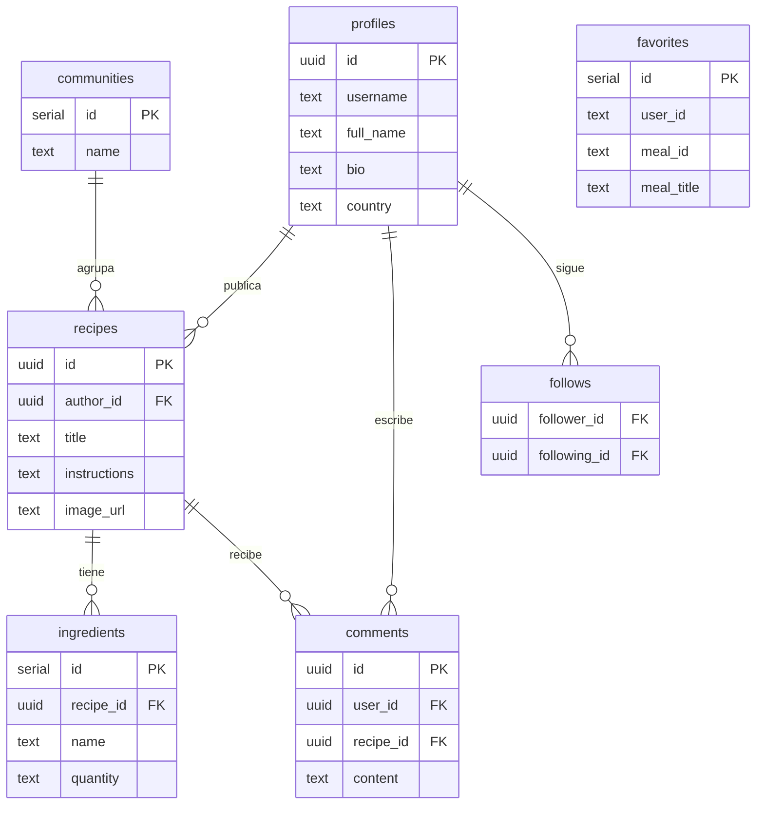
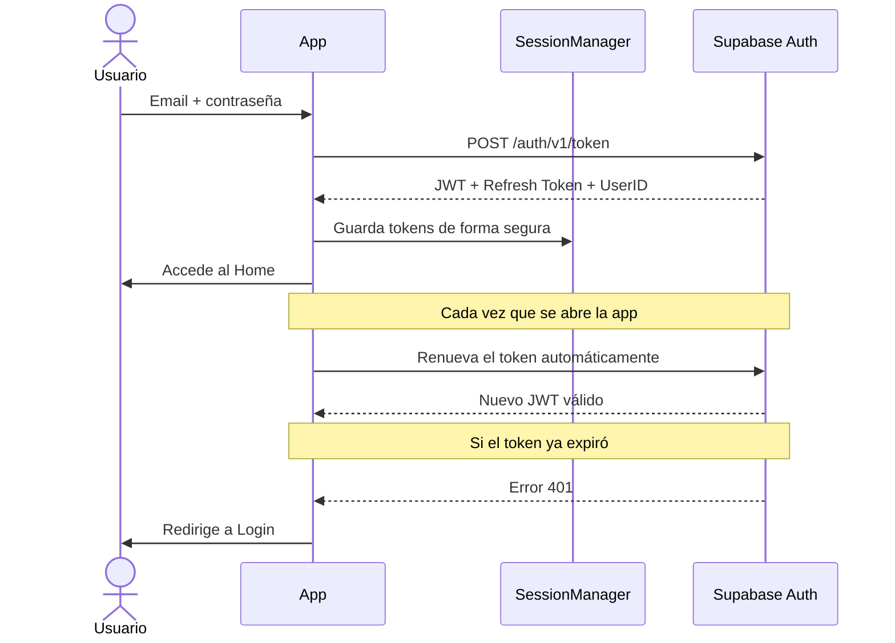
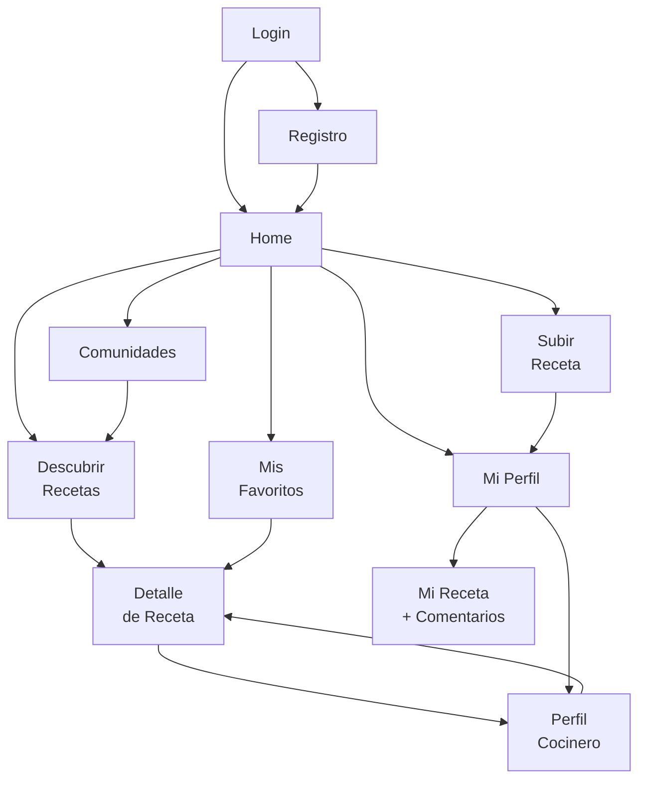
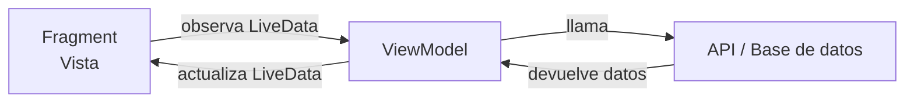

# CreeshApp — Guía Completa de Presentación

> Documentación organizada para 3 personas. Cada sección cubre una parte de la presentación.
> Al final hay una sección que explica **todo** de forma integrada.

---

## Índice

- [Persona 1 — Conceptos, Diagramas e Interacción](#persona-1--conceptos-diagramas-e-interacción-de-la-app)
- [Persona 2 — Frontend (Estructura Android)](#persona-2--frontend-estructura-android)
- [Persona 3 — Backend y APIs](#persona-3--backend-y-apis)
- [Explicación Completa — Todo el Sistema](#explicación-completa--todo-el-sistema)

---

---

# Persona 1 — Conceptos, Diagramas e Interacción de la App

---

## ¿Qué es CreeshApp?

CreeshApp es una aplicación móvil para Android que permite a los usuarios **descubrir, guardar y compartir recetas de cocina**.

**El problema que resuelve:** Las recetas internacionales están en inglés, dispersas en múltiples sitios. CreeshApp centraliza miles de recetas, las traduce automáticamente al español y permite a los usuarios publicar las suyas propias.

**¿Qué puede hacer un usuario?**

- Explorar miles de recetas internacionales traducidas al español
- Buscar por nombre o filtrar por categoría
- Guardar recetas favoritas de forma permanente
- Publicar sus propias recetas con fotos e ingredientes
- Seguir a cocineros de la comunidad
- Participar en comunidades temáticas (Vegano, Gym Rats, Postres, etc.)
- Comentar en recetas de otros usuarios

---

## Stack tecnológico

| Componente | Tecnología | ¿Para qué? |
|---|---|---|
| App Android | Kotlin | El lenguaje oficial de Android |
| Patrón | MVVM | Organizar la arquitectura de la app |
| Base de datos | Supabase (PostgreSQL) | Guardar usuarios, recetas, comentarios |
| Autenticación | Supabase Auth (JWT) | Login y registro seguros |
| Imágenes | Supabase Storage | Guardar las fotos de recetas |
| Recetas externas | TheMealDB API | Proveer 300+ recetas con fotos |
| Traducción | MyMemory API | Traducir automáticamente de inglés a español |
| Cocineros | RandomUser API | Generar perfiles de cocineros realistas |
| Carga de imágenes | Glide | Mostrar imágenes de forma eficiente |

---

## Diagrama 1 — Arquitectura de la App (MVVM)

La app se organiza en 4 capas:



**El flujo es siempre el mismo:** El Fragment observa → el ViewModel pide datos → la API llama al servidor → los datos regresan → la pantalla se actualiza automáticamente.

---

## Diagrama 2 — Base de Datos

Las tablas de la base de datos y cómo se relacionan:



---

## Diagrama 3 — Flujo de Autenticación

Cómo funciona el login y la seguridad de la sesión:



---

## Diagrama 4 — Navegación entre Pantallas

Cómo el usuario se mueve por la app:



---

## Demostración en vivo — Orden sugerido

Al presentar, seguir este orden para mostrar la app:

1. Abrir la app → pantalla de Login
2. Registrar una cuenta nueva con email y contraseña
3. Explorar el Home → receta destacada
4. Ir a Descubrir → buscar "pasta"
5. Abrir el detalle de una receta → mostrar la traducción automática
6. Guardar como favorito (❤️)
7. Ir a Favoritos → ver la receta guardada
8. Subir una receta propia con foto e ingredientes
9. Ver Mi Perfil → receta publicada aparece ahí
10. Entrar a una Comunidad → filtrar por tema
11. Ver el perfil de un cocinero y seguirlo
12. Cerrar sesión → vuelve al Login

---

## Puntos clave para mencionar

- Los datos son **reales y en la nube** — no simulados ni hardcodeados
- La traducción ocurre **automáticamente** — el usuario no hace nada
- Los favoritos y recetas propias **persisten entre sesiones**
- La app usa **JWT** — el usuario no tiene que volver a loguearse si la usa regularmente
- Las comunidades permiten **filtrar contenido** por tema de interés

---

---

# Persona 2 — Frontend (Estructura Android)

---

## 1. El Patrón MVVM

La app usa **MVVM (Model-View-ViewModel)**, el estándar oficial de Google para Android moderno.

| Capa | ¿Qué es? | En CreeshApp |
|---|---|---|
| **View** | Lo que el usuario ve | Fragments + layouts XML |
| **ViewModel** | La lógica de la app | RecipeViewModel, AuthViewModel, SocialViewModel |
| **Model** | Los datos | APIs, Supabase, data classes |



**Por qué importa:** Si el teléfono rota, el ViewModel sobrevive. Los datos no se pierden. Sin MVVM, la app colapsaría con cada rotación de pantalla.

---

## 2. Estructura de paquetes

```
app/src/main/java/com/creesh/app/
├── adapters/       → Conectan listas de datos con RecyclerViews
├── api/            → Un cliente Retrofit por cada servicio externo
│   └── models/     → Data classes (objetos de datos, como los de la BD)
├── fragments/      → Cada pantalla es un Fragment
├── viewmodel/      → Lógica de negocio separada de la UI
└── utils/          → SessionManager (gestión de sesión y tokens)
```

---

## 3. Las pantallas (Fragments)

Cada pantalla es un **Fragment**. Todos comparten un único `Activity` (`MainActivity`).

| Fragment | Función |
|---|---|
| `LoginFragment` | Inicio de sesión |
| `RegisterFragment` | Crear cuenta nueva |
| `HomeFragment` | Landing: receta destacada + 4 accesos rápidos |
| `DiscoverFragment` | Buscar y explorar recetas (cuadrícula + búsqueda) |
| `FavoritesFragment` | Ver recetas guardadas con ❤️ |
| `ProfileFragment` | Mi perfil: stats, mis recetas, cocineros seguidos |
| `UploadRecipeFragment` | Formulario para publicar una receta |
| `RecipeDetailFragment` | Detalle de receta con traducción automática |
| `MyRecipeDetailFragment` | Detalle de mi receta con comentarios |
| `ChefProfileFragment` | Perfil de un cocinero con botón seguir |
| `CommunitiesFragment` | Lista de comunidades para filtrar por tema |

---

## 4. Navegación con NavComponent

La app usa **Android Navigation Component**. Un único archivo `nav_graph.xml` define todos los caminos posibles.

```kotlin
// Para navegar a otra pantalla:
findNavController().navigate(R.id.action_homeFragment_to_discoverFragment)

// Para volver atrás:
findNavController().navigateUp()
```

El `BottomNavigationView` tiene 3 items: Inicio, Mi Perfil y Salir. Cuando el usuario está en Discover o Communities (que no están en el menú), "Inicio" queda seleccionado automáticamente.

---

## 5. ViewBinding — Acceso seguro a las vistas

En lugar del clásico `findViewById()` (que puede causar crashes en runtime), la app usa **ViewBinding**:

```kotlin
// Sin ViewBinding — propenso a errores
val button = findViewById<Button>(R.id.btnLogin) // NullPointerException posible

// Con ViewBinding — seguro en compilación
binding.btnLogin.setOnClickListener { login() }  // Error en compilación, no en runtime
```

Cada layout XML genera automáticamente su propia clase `Binding`.

---

## 6. LiveData y Observers — Reactividad

Los ViewModels exponen sus datos como `LiveData`. Los Fragments los observan y se actualizan solos.

```kotlin
// En RecipeViewModel — expone datos
private val _meals = MutableLiveData<List<Meal>>(emptyList())
val meals: LiveData<List<Meal>> = _meals

// En DiscoverFragment — observa
viewModel.meals.observe(viewLifecycleOwner) { listaDeMeals ->
    adapter.submitList(listaDeMeals)  // la cuadrícula se actualiza sola
}
```

Cuando llegan nuevas recetas de la API, la cuadrícula se actualiza **sin que el Fragment tenga que hacer nada más**.

---

## 7. Adaptadores (RecyclerView)

Los `RecyclerView` muestran listas eficientes. Cada lista necesita un adaptador.

| Adaptador | ¿Qué muestra? | ¿Dónde? |
|---|---|---|
| `RecipeAdapter` | Cuadrícula de recetas (2 columnas) | Discover |
| `RecipeHorizontalAdapter` | Carrusel horizontal | Home (Hidden Gems) |
| `FavoriteAdapter` | Cuadrícula de favoritos | Favorites |
| `MyRecipeAdapter` | Mis recetas publicadas | Profile |
| `ChefAdapter` | Cocineros seguidos (horizontal) | Profile |
| `CommentAdapter` | Lista de comentarios | MyRecipeDetail |
| `CommunityAdapter` | Lista de comunidades | Communities |
| `IngredientAdapter` | Ingredientes de una receta | RecipeDetail |

---

## 8. SessionManager

Objeto singleton que persiste la sesión del usuario usando `SharedPreferences`.

```kotlin
object SessionManager {
    fun saveSession(userId, token, email, refreshToken) // al hacer login
    fun getToken(): String?       // JWT para autorizar peticiones a la API
    fun getUserId(): String?      // UUID del usuario en Supabase
    fun isLoggedIn(): Boolean     // ¿hay sesión activa?
    fun isSessionExpired(): Boolean  // timeout de 30 min de inactividad
    fun saveDisplayName(name)     // nombre visible del usuario
    fun saveFollowedChefs(ids)    // IDs de cocineros seguidos
    fun clearSession()            // logout — solo borra tokens
}
```

**Decisión de diseño clave:** `clearSession()` NO borra el nombre ni los cocineros seguidos (están guardados con clave del userId). Si el mismo usuario vuelve a iniciar sesión, recupera su configuración.

---

## 9. Glide — Carga de imágenes

Todas las imágenes remotas se muestran con **Glide**, que maneja caché, placeholders y transformaciones:

```kotlin
Glide.with(this)
    .load(meal.thumbnail)                                      // URL
    .centerCrop()                                              // recorta al centro
    .placeholder(android.R.drawable.ic_menu_gallery)           // mientras carga
    .into(binding.ivRecipeHeader)                              // ImageView destino
```

---

## 10. Diseño UI

- **Color primario:** Naranja `#F4831F` (consistencia de marca)
- **Tema:** Material Design — `MaterialButton`, `TextInputLayout`
- **Header naranja** fijo en todas las pantallas
- **Estados vacíos** en todas las listas (mensaje + emoji si no hay datos)
- **Estado de error** con botón de reintentar en Discover
- **Animaciones** slide-in/out entre pantallas

---

---

# Persona 3 — Backend y APIs

---

## 1. El Backend: Supabase

No se construyó un servidor desde cero. Se usó **Supabase** — una plataforma que da todo lo necesario:

- Base de datos **PostgreSQL** lista para usar
- **Autenticación** (email/contraseña, OAuth)
- **Storage** para imágenes
- **API REST automática** para cada tabla
- **Row Level Security** para que cada usuario solo acceda a sus datos

---

## 2. La Base de Datos

### 7 tablas principales:

| Tabla | ¿Qué guarda? |
|---|---|
| `profiles` | Nombre, bio, país y especialidad de cada usuario |
| `recipes` | Recetas que los usuarios publican |
| `ingredients` | Ingredientes de cada receta publicada |
| `favorites` | Recetas externas (TheMealDB) que el usuario guardó |
| `comments` | Comentarios en recetas de otros usuarios |
| `communities` | Las 9 comunidades temáticas |
| `follows` | Relaciones de seguimiento |

### Trigger automático al registrarse:

```sql
CREATE OR REPLACE FUNCTION handle_new_user()
RETURNS TRIGGER AS $$
BEGIN
  INSERT INTO public.profiles (id, username, full_name)
  VALUES (NEW.id, split_part(NEW.email, '@', 1), split_part(NEW.email, '@', 1));
  RETURN NEW;
END;
$$ LANGUAGE plpgsql SECURITY DEFINER;
```

Cuando alguien se registra, este trigger crea automáticamente su perfil.

---

## 3. Autenticación con JWT

**¿Qué es un JWT?** Un token firmado digitalmente que certifica quién es el usuario. La app lo envía en cada petición a la API.

### Flujo de login:

```
1. POST /auth/v1/token  con {email, password}
2. Supabase verifica las credenciales
3. Devuelve: accessToken (JWT ~1h) + refreshToken
4. App guarda en SharedPreferences
5. Cada petición incluye: Authorization: Bearer <JWT>
```

### Renovación automática:

```
App en onResume() → envía refreshToken → recibe nuevo JWT
Sin interrupciones para el usuario
```

### Si el token expira sin renovarse:

```
API devuelve 401 → Interceptor de OkHttp detecta
→ clearSession() → redirige al Login
```

---

## 4. APIs Externas

### TheMealDB — Fuente de recetas

| Endpoint | Función |
|---|---|
| `GET /search.php?s={nombre}` | Buscar por nombre |
| `GET /lookup.php?i={id}` | Detalle completo |
| `GET /random.php` | Receta aleatoria |
| `GET /filter.php?c={categoria}` | Filtrar por categoría |
| `GET /categories.php` | Listar categorías |

### MyMemory — Traducción en tiempo real

```
Texto en inglés (instrucciones de receta)
→ Dividir en fragmentos de 450 chars (límite de la API)
→ GET /get?q={fragmento}&langpair=en|es (por cada fragmento)
→ Unir respuestas
→ Mostrar progresivamente mientras llegan
```

### RandomUser — Cocineros

```
GET /api/?results=12&seed=creesh2024
```

El `seed` fijo garantiza que los mismos 12 cocineros aparezcan siempre (determinístico). Sin seed, serían aleatorios y cambiarían en cada llamada.

---

## 5. Supabase Storage — Imágenes de recetas

```
Usuario selecciona foto
→ App comprime y convierte a bytes
→ PUT /storage/v1/object/recipes/{userId}/{timestamp}.jpg
→ Supabase guarda en bucket "recipes"
→ Devuelve URL pública
→ App guarda esa URL en la columna image_url de la tabla recipes
```

La URL pública permite que cualquier usuario (con acceso) vea la imagen directamente.

---

## 6. Row Level Security (RLS) — Seguridad a nivel de BD

RLS garantiza que la base de datos misma proteja los datos, sin depender solo de la app.

**Ejemplo:**

```sql
-- Solo ver TUS favoritos
CREATE POLICY "favoritos propios"
ON favorites FOR SELECT
USING (user_id = auth.uid()::text);

-- Solo insertar favoritos como tú mismo
CREATE POLICY "insertar favorito"
ON favorites FOR INSERT
WITH CHECK (user_id = auth.uid()::text);
```

Incluso si alguien obtiene el JWT de otro usuario, **la base de datos bloquea el acceso**.

---

## 7. Endpoints del Backend (resumen)

**Base URL:** `https://thvktcqdmufbdvorrpgh.supabase.co`

| Operación | Método | Endpoint |
|---|---|---|
| Login | POST | `/auth/v1/token?grant_type=password` |
| Registro | POST | `/auth/v1/signup` |
| Refresh token | POST | `/auth/v1/token?grant_type=refresh_token` |
| Mis recetas | GET | `/rest/v1/recipes?author_id=eq.{userId}` |
| Crear receta | POST | `/rest/v1/recipes` |
| Mis favoritos | GET | `/rest/v1/favorites?user_id=eq.{userId}` |
| Agregar favorito | POST | `/rest/v1/favorites` |
| Quitar favorito | DELETE | `/rest/v1/favorites?user_id=eq.{id}&meal_id=eq.{id}` |
| Comentarios | GET | `/rest/v1/comments?recipe_id=eq.{id}` |
| Subir imagen | PUT | `/storage/v1/object/recipes/{path}` |

---

## 8. Puntos clave para mencionar

- **Sin servidor propio** — Supabase elimina la necesidad de mantener infraestructura
- **PostgreSQL real** — base de datos relacional robusta, no un servicio simplificado
- **JWT estándar** — el mismo esquema de autenticación que usan Netflix, Spotify, etc.
- **Dos capas de seguridad**: JWT en la app + RLS en la base de datos
- **Datos reales** en TheMealDB — más de 300 recetas con fotos e instrucciones reales
- **Traducción en tiempo real** — no hay textos hardcodeados; se traduce en el momento

---

---

# Explicación Completa — Todo el Sistema

---

## ¿Qué es CreeshApp?

CreeshApp es una aplicación Android de recetas de cocina. Integra datos de múltiples fuentes (TheMealDB, RandomUser, MyMemory) con un backend propio en Supabase, permitiendo a los usuarios descubrir recetas internacionales traducidas, guardar favoritos, publicar sus propias recetas y participar en comunidades.

---

## Stack tecnológico completo

**Frontend:**
- Kotlin con Android SDK (minSdk 24, targetSdk 34)
- Arquitectura MVVM con LiveData y Coroutines
- Navigation Component + BottomNavigationView
- ViewBinding para acceso seguro a vistas
- Glide para carga de imágenes con caché
- Material Design 3

**Backend:**
- Supabase (PostgreSQL + Auth + Storage)
- Row Level Security en todas las tablas
- JWT con refresh tokens automáticos
- Retrofit 2 + OkHttp3 para llamadas HTTP
- Gson para serialización JSON

**APIs Externas:**
- TheMealDB (recetas)
- MyMemory Translation API (traducción EN→ES)
- RandomUser API (perfiles de cocineros)

---

## Arquitectura completa

```
┌────────────────────────────────────────────────────────────────┐
│                         MainActivity                           │
│              (1 Activity, host de todos los Fragments)         │
│              BottomNavigationView: Home · Perfil · Salir       │
└────────────────────────────────────────────────────────────────┘
                              │
             ┌────────────────┼────────────────┐
             ▼                ▼                ▼
    ┌──────────────┐  ┌──────────────┐  ┌──────────────┐
    │  FRAGMENTS   │  │  VIEWMODELS  │  │  ADAPTADORES │
    │  (11 pantallas) │  │  (3 clases)  │  │  (8 clases)  │
    └──────────────┘  └──────────────┘  └──────────────┘
             │                │
             └────────────────┘
                              │
             ┌────────────────┼────────────────┐
             ▼                ▼                ▼
    ┌──────────────┐  ┌──────────────┐  ┌──────────────┐
    │  SUPABASE    │  │  THEMEALDB   │  │   MYMEMORY   │
    │  (DB+Auth    │  │  (Recetas)   │  │  (Traducción)│
    │  +Storage)   │  │              │  │              │
    └──────────────┘  └──────────────┘  └──────────────┘
```

---

## La base de datos en detalle

**7 tablas en PostgreSQL:**

1. **`profiles`** — Un registro por usuario. Se crea automáticamente al registrarse (trigger). Guarda nombre, bio, país, especialidad.

2. **`recipes`** — Recetas que los usuarios publican. Incluyen título (inglés + español), instrucciones, imagen y dificultad.

3. **`ingredients`** — Ingredientes de cada receta publicada, con nombre, cantidad, unidad y orden.

4. **`favorites`** — Recetas de TheMealDB que el usuario guardó. Al ser externas, se guardan con su ID y datos básicos.

5. **`comments`** — Comentarios de usuarios en recetas publicadas por otros.

6. **`communities`** — 9 comunidades fijas: Gym Rats, Vegano, Vegetariano, Amantes de la Carne, Mariscos, Postres y Dulces, Pasta e Italiana, Cocina Asiática, Variado.

7. **`follows`** — Tabla de relación muchos-a-muchos para el seguimiento entre usuarios.

---

## Flujo completo de una receta (de inicio a fin)

```
1. App inicia → SessionManager verifica si hay JWT guardado
   └─ Si hay JWT → refresca con Supabase → HomeFragment
   └─ Si no → LoginFragment

2. HomeFragment carga
   └─ RecipeViewModel.loadHiddenGems()
   └─ GET /search.php?f=x → TheMealDB
   └─ Muestra 1 receta destacada + 4 botones de acceso rápido

3. Usuario toca "Descubrir"
   └─ DiscoverFragment carga
   └─ RecipeViewModel.loadRandomMeals()
   └─ 4 peticiones a TheMealDB con letras aleatorias (c, b, s, p)
   └─ Muestra cuadrícula de recetas

4. Usuario toca una receta
   └─ RecipeViewModel.selectedMeal = meal
   └─ Navega a RecipeDetailFragment
   └─ Si faltan datos → GET /lookup.php?i={id}
   └─ Glide carga la imagen
   └─ TranslationClient traduce título e instrucciones en chunks
   └─ SocialViewModel asigna un cocinero determinístico

5. Usuario toca ❤️
   └─ RecipeViewModel.toggleFavorite()
   └─ POST /favorites con {user_id, meal_id, meal_title, meal_image}
   └─ Supabase guarda el favorito
   └─ El ❤️ cambia a lleno — la próxima vez que abra Favoritos estará ahí

6. Usuario sube una receta propia
   └─ UploadRecipeFragment: llena formulario
   └─ RecipeViewModel.publishRecipe():
      1. SupabaseStorageClient.uploadImage() → PUT /storage/v1/object/recipes/...
      2. SupabaseApi.addRecipe() → POST /recipes
      3. SupabaseApi.addIngredients() → POST /ingredients (en batch)
   └─ Navega a ProfileFragment → la receta aparece en "Mis Recetas"
```

---

## Seguridad (resumen)

| Capa | Mecanismo |
|---|---|
| Contraseña | Manejada por Supabase Auth — la app nunca la ve |
| Sesión | JWT (~1h) + refresh token automático |
| Inactividad | Timeout de 30 minutos → redirige a Login |
| Acceso a datos | Row Level Security: la BD misma filtra por usuario |
| Conexiones | HTTPS obligatorio en todo el tráfico de red |

---

## Decisiones de diseño importantes

**1. 1 Activity, múltiples Fragments:**
Todo ocurre dentro de `MainActivity`. Es el patrón moderno de Android — mejor rendimiento, navegación fluida con animaciones y backstack automático.

**2. Cocineros determinísticos:**
Los cocineros de RandomUser se asignan usando `hash(meal.category) % 12`. El mismo cocinero siempre aparece con la misma categoría de receta, dando consistencia visual aunque sean datos generados.

**3. Traducción en chunks:**
MyMemory tiene un límite de 450 caracteres por petición. Las instrucciones largas se dividen y traducen en paralelo, mostrando el resultado progresivamente.

**4. `clearSession()` no borra todo:**
Al cerrar sesión, se borran los tokens pero no el nombre ni los cocineros seguidos (guardados con clave del userId). Si el mismo usuario vuelve a iniciar sesión, recupera su estado.

**5. Favoritos de TheMealDB vs recetas propias:**
Son dos sistemas separados. Los favoritos de TheMealDB se guardan con los datos básicos de la receta (por si la API externa cambia). Las recetas propias se guardan completas en Supabase.

---

## Estructura de archivos clave

```
CreeshApp/
├── app/src/main/java/com/creesh/app/
│   ├── MainActivity.kt                   ← Único Activity
│   ├── api/                              ← 6 clientes Retrofit + modelos
│   ├── fragments/                        ← 11 pantallas
│   ├── viewmodel/                        ← 3 ViewModels
│   ├── adapters/                         ← 8 adaptadores RecyclerView
│   └── utils/SessionManager.kt          ← Sesión y SharedPreferences
├── app/src/main/res/
│   ├── layout/                           ← 11 layouts XML
│   ├── navigation/nav_graph.xml          ← Mapa de navegación
│   └── menu/bottom_nav_menu.xml          ← Menú inferior
├── database/schema.sql                   ← Esquema completo de Supabase
└── docs/
    ├── diagrams/                         ← 4 diagramas individuales
    ├── PRESENTACION_1_Conceptos_y_Diagramas.md
    ├── PRESENTACION_2_Frontend.md
    ├── PRESENTACION_3_Backend.md
    └── GUIA_PRESENTACION_COMPLETA.md     ← Este archivo
```
