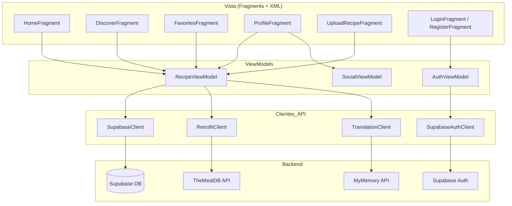
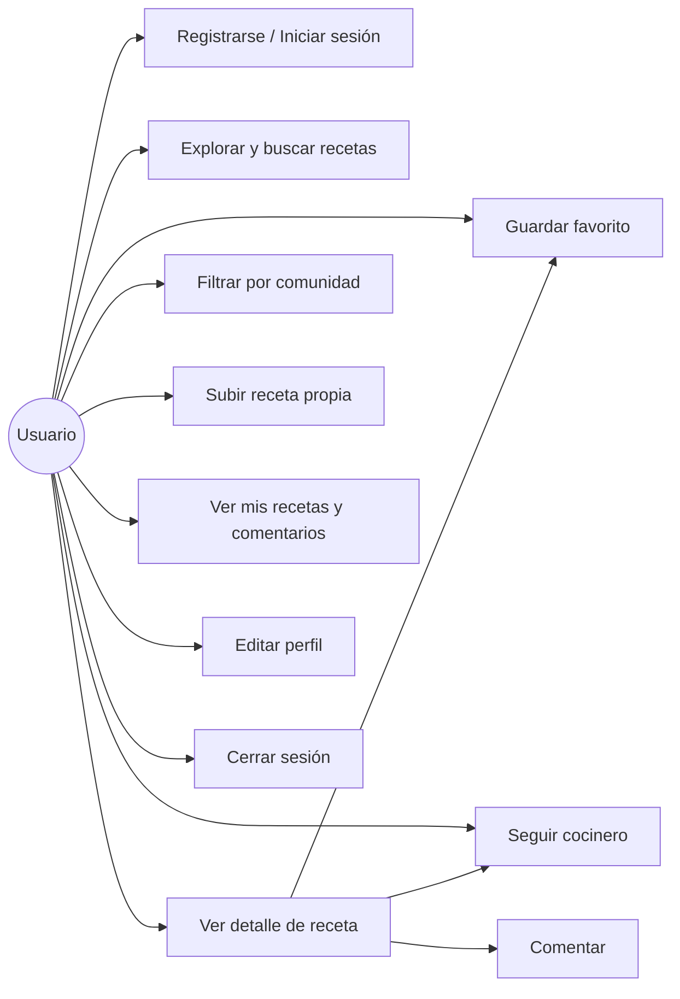
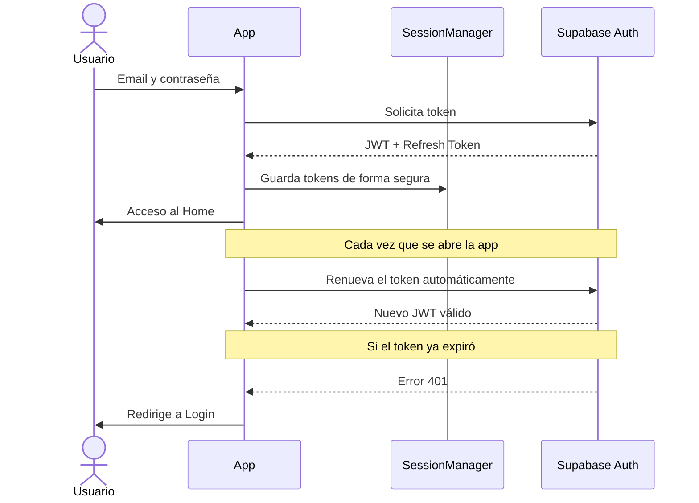
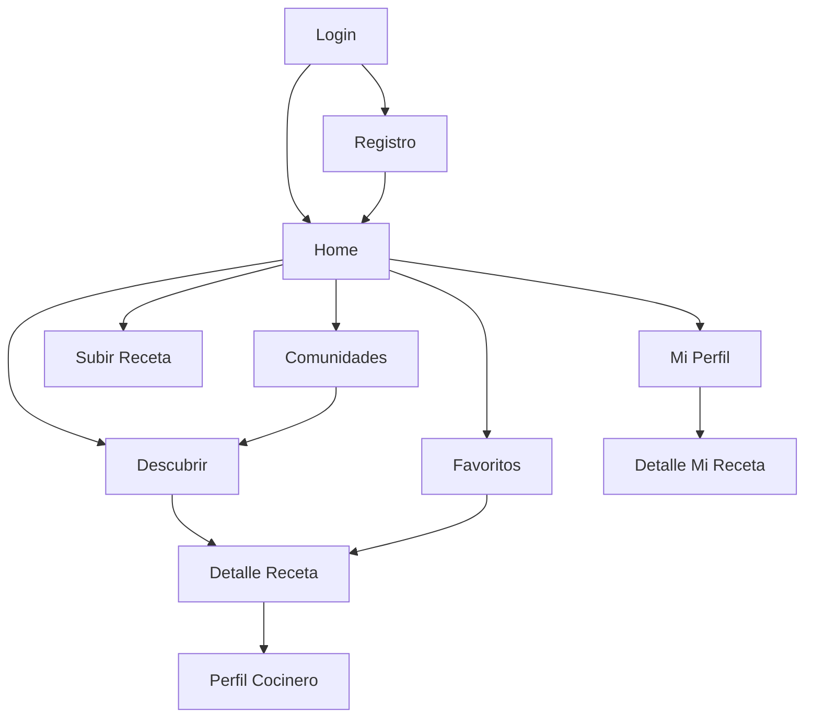

# Presentación 1 — Conceptos, Diagramas e Interacción

> **Sección a cargo de:** Conceptos generales, diagramas de la aplicación y demostración del flujo de usuario.

---

## 1. ¿Qué es CreeshApp?

CreeshApp es una aplicación móvil de recetas de cocina para Android. Permite a los usuarios:

- **Descubrir** miles de recetas internacionales traducidas al español
- **Guardar** sus recetas favoritas de forma permanente
- **Publicar** sus propias recetas con ingredientes e instrucciones
- **Seguir** a cocineros de la comunidad
- **Participar** en comunidades temáticas (vegano, parrilla, postres, etc.)
- **Comentar** recetas de otros usuarios

**¿Por qué CreeshApp?**
La app resuelve el problema de dispersión: el usuario no necesita buscar en múltiples sitios. Tiene todo en un solo lugar, personalizado y en español.

---

## 2. Tecnologías utilizadas

| Componente | Tecnología |
|---|---|
| App Android | Kotlin |
| Patrón de diseño | MVVM (Model-View-ViewModel) |
| Base de datos | Supabase (PostgreSQL) |
| Autenticación | Supabase Auth (JWT) |
| Almacenamiento | Supabase Storage |
| Recetas externas | TheMealDB API |
| Traducción | MyMemory API |
| Cocineros | RandomUser API |
| Imágenes | Glide |

---

## 3. Diagrama de Arquitectura

La app sigue el patrón **MVVM**: la Vista no sabe cómo se obtienen los datos, solo los muestra. El ViewModel contiene la lógica. Los Clientes API se comunican con el backend.

**Punto clave:** Los Fragments observan LiveData del ViewModel. Cuando los datos cambian, la pantalla se actualiza automáticamente.

---

## 4. Diagrama de Casos de Uso

Muestra qué puede hacer un usuario con la app:

---

## 5. Flujo de Autenticación

Cómo funciona el login y la seguridad de la sesión:

---

## 6. Navegación entre pantallas

---

## 7. Demostración — Flujo del usuario

Al presentar, seguir este orden para mostrar la app en vivo:

1. **Abrir la app** → muestra la pantalla de login
2. **Registrar una cuenta nueva** → con email y contraseña
3. **Explorar el Home** → receta destacada + botones de acceso rápido
4. **Buscar una receta** desde el Home → va a Discover con resultado
5. **Abrir el detalle** de una receta → mostrar traducción automática
6. **Guardar como favorito** → ❤️
7. **Entrar a Favoritos** → ver receta guardada
8. **Subir una receta propia** → rellenar el formulario
9. **Ver Mi Perfil** → mostrar contadores y receta publicada
10. **Entrar a una Comunidad** → filtrar por tema
11. **Cerrar sesión** → vuelve al login

---

## Puntos clave para mencionar

- La app funciona con datos **reales en la nube** (no simulados)
- Las recetas se traducen **automáticamente** al español
- Los favoritos y recetas propias **persisten entre sesiones**
- La seguridad usa **JWT** con renovación automática — el usuario nunca tiene que volver a loguearse si usa la app regularmente
