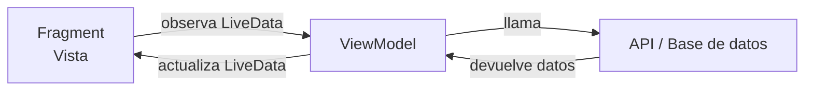
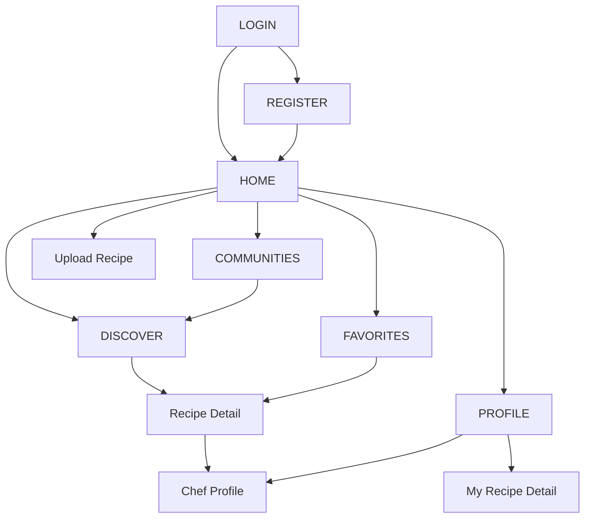

# Presentación 2 — Frontend (Estructura Android)

> **Sección a cargo de:** Arquitectura de la app Android, patrón MVVM, navegación, adaptadores y decisiones de interfaz.

---

## 1. Patrón MVVM

La app usa el patrón **Model-View-ViewModel**, el estándar recomendado por Google para Android.

| Capa | Responsabilidad | En la app |
|---|---|---|
| **View** | Mostrar datos, capturar eventos del usuario | Fragments + XML layouts |
| **ViewModel** | Lógica de negocio, mantener estado | RecipeViewModel, AuthViewModel, SocialViewModel |
| **Model** | Datos y fuentes externas | APIs, Supabase, data classes |

**Ventaja principal:** Si el usuario rota el teléfono, el ViewModel sobrevive — los datos no se pierden.



---

## 2. Estructura de paquetes

```
com.creesh.app/
├── adapters/       → Conectan datos con listas (RecyclerView)
├── api/            → Clientes HTTP para cada servicio externo
│   └── models/     → Data classes (objetos de datos)
├── fragments/      → Cada pantalla de la app
├── viewmodel/      → Lógica de negocio
└── utils/          → Herramientas transversales (SessionManager)
```

---

## 3. Fragments — Las pantallas

Cada pantalla es un `Fragment`. Todos comparten el mismo `Activity` (`MainActivity`).

| Fragment | Función |
|---|---|
| `LoginFragment` | Inicio de sesión |
| `RegisterFragment` | Registro de cuenta |
| `HomeFragment` | Pantalla principal con accesos rápidos |
| `DiscoverFragment` | Búsqueda y exploración de recetas |
| `FavoritesFragment` | Recetas guardadas del usuario |
| `ProfileFragment` | Perfil: nombre, stats, mis recetas, siguiendo |
| `UploadRecipeFragment` | Formulario para publicar una receta |
| `RecipeDetailFragment` | Detalle de receta de TheMealDB |
| `MyRecipeDetailFragment` | Detalle de receta propia con comentarios |
| `ChefProfileFragment` | Perfil de un cocinero |
| `CommunitiesFragment` | Lista de comunidades temáticas |

---

## 4. Navegación con NavComponent

La navegación entre pantallas usa **Android Navigation Component**. Hay un único archivo `nav_graph.xml` que define todas las rutas.



**Cómo funciona:**
```kotlin
// Navegar a una pantalla
findNavController().navigate(R.id.action_homeFragment_to_recipeDetailFragment)

// Volver atrás
findNavController().navigateUp()
```

El `BottomNavigationView` también usa el NavComponent. Cuando el destino no está en el menú (Discover, Communities), el ítem "Inicio" queda seleccionado automáticamente.

---

## 5. ViewBinding

En lugar de `findViewById()`, la app usa **ViewBinding**. Genera una clase para cada layout XML, dando acceso directo a las vistas con seguridad de tipos.

```kotlin
// Sin ViewBinding (propenso a errores)
val button = findViewById<Button>(R.id.btnLogin)

// Con ViewBinding (seguro, limpio)
private val binding get() = _binding!!
binding.btnLogin.setOnClickListener { ... }
```

---

## 6. LiveData y Observers

Los ViewModels exponen datos como `LiveData`. Los Fragments los observan y se actualizan automáticamente cuando cambian.

```kotlin
// En RecipeViewModel:
private val _favorites = MutableLiveData<List<FavoriteItem>>(emptyList())
val favorites: LiveData<List<FavoriteItem>> = _favorites

// En ProfileFragment:
viewModel.favorites.observe(viewLifecycleOwner) { favs ->
    binding.tvFavoritesCount.text = favs.size.toString()
}
```

Cuando `_favorites` se actualiza (tras guardar o cargar favoritos), el contador en pantalla se actualiza solo.

---

## 7. Adaptadores (RecyclerView)

Los `RecyclerView` muestran listas de elementos. Cada lista necesita un adaptador que conecta los datos con las vistas.

| Adaptador | Lista que muestra |
|---|---|
| `RecipeAdapter` | Grid de recetas (Discover) |
| `RecipeHorizontalAdapter` | Carrusel horizontal (Hidden Gems) |
| `FavoriteAdapter` | Grid de favoritos |
| `MyRecipeAdapter` | Grid de mis recetas en el perfil |
| `ChefAdapter` | Cocineros seguidos (horizontal) |
| `CommentAdapter` | Comentarios en detalle de receta |
| `CommunityAdapter` | Lista de comunidades |
| `IngredientAdapter` | Ingredientes de una receta |

---

## 8. SessionManager

`SessionManager` es un objeto singleton que maneja los datos de sesión del usuario usando `SharedPreferences`.

```kotlin
object SessionManager {
    fun saveSession(userId, token, email, refreshToken)  // guarda al hacer login
    fun getToken(): String?       // JWT para las llamadas a la API
    fun getUserId(): String?      // UUID del usuario en Supabase
    fun isLoggedIn(): Boolean     // verifica si hay sesión activa
    fun isSessionExpired(): Boolean  // timeout de 30 min de inactividad
    fun saveFollowedChefs(...)    // persiste los chefs seguidos
    fun saveDisplayName(...)      // persiste el nombre del usuario
    fun clearSession()            // solo borra datos de auth, no del usuario
}
```

**Decisión importante:** `clearSession()` NO borra los datos del usuario (nombre, chefs seguidos) porque están guardados con la clave del `userId`. Si el mismo usuario vuelve a iniciar sesión, recupera su configuración.

---

## 9. Glide — Carga de imágenes

Todas las imágenes remotas se cargan con **Glide**, que maneja caché, placeholders y transformaciones:

```kotlin
Glide.with(this)
    .load(meal.thumbnail)   // URL de la imagen
    .centerCrop()           // recorta al centro
    .placeholder(android.R.drawable.ic_menu_gallery)  // imagen mientras carga
    .into(binding.ivRecipeHeader)  // ImageView destino
```

---

## 10. Decisiones de diseño UI

- **Colores:** Naranja primario (`#F4831F`) para consistencia de marca
- **Tema:** Material Design con componentes estándar (`MaterialButton`, `TextInputLayout`)
- **Header naranja** en todas las pantallas para cohesión visual
- **Estados vacíos** en todas las listas (emoji + mensaje descriptivo)
- **Estados de error** con botón de reintentar en Discover
- **Bottom nav** siempre visible excepto en pantallas de detalle y auth
