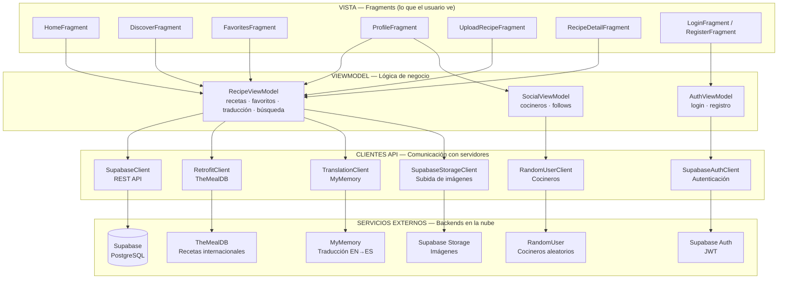

# Diagrama 1 — Arquitectura MVVM de CreeshApp

> Muestra cómo se organiza la app en capas: Vista, ViewModel y fuentes de datos.

## ¿Por qué MVVM?

| Sin MVVM | Con MVVM |
|---|---|
| El Fragment llama directamente a la API | El Fragment solo observa datos |
| Si el teléfono rota, se pierde todo | El ViewModel sobrevive a la rotación |
| Las pantallas son difíciles de reutilizar | La lógica está separada de la UI |
| Imposible hacer pruebas unitarias | El ViewModel se puede probar sin Android |

**Flujo de datos:** Fragment observa LiveData → ViewModel hace la petición → API Client llama al servidor → respuesta actualiza LiveData → Fragment se actualiza automáticamente.
