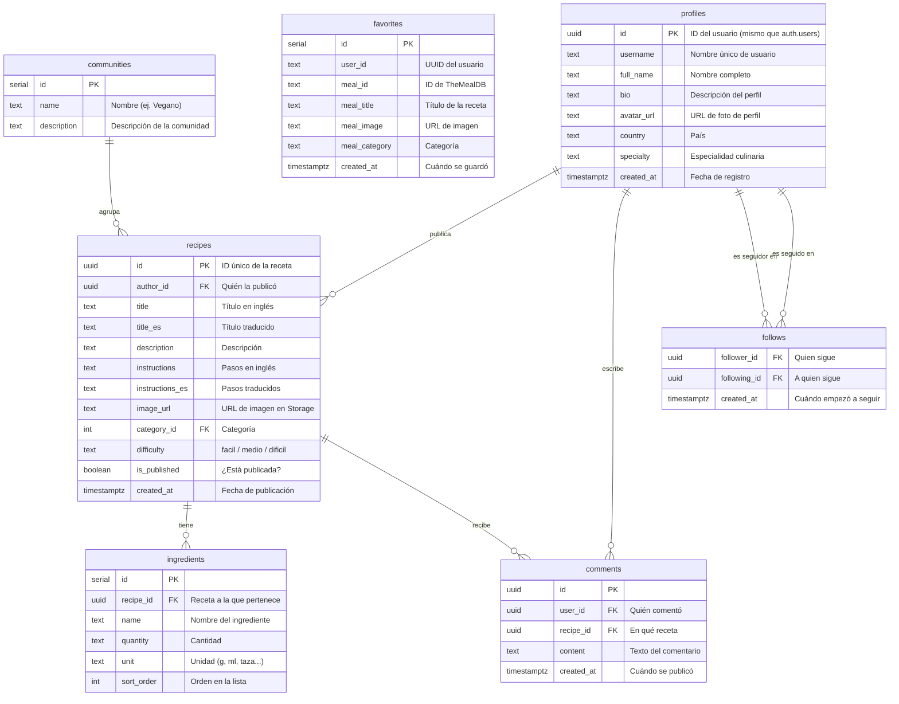

# Diagrama 2 — Base de Datos (Entidad-Relación)

> Muestra las 7 tablas de Supabase (PostgreSQL) y cómo se relacionan entre sí.

## Notas importantes

- **`profiles`** se crea automáticamente cuando un usuario se registra (via trigger en Supabase)
- **`favorites`** guarda recetas de **TheMealDB** (externas), no recetas propias
- **`recipes`** son las recetas que los **usuarios publican** en la app
- **Row Level Security (RLS):** cada usuario solo puede ver y modificar sus propios registros
- La tabla **`auth.users`** es gestionada automáticamente por Supabase Auth — no aparece en el diagrama porque es interna

## Comunidades predefinidas

| ID | Nombre |
|---|---|
| 1 | Gym Rats |
| 2 | Vegano |
| 3 | Vegetariano |
| 4 | Amantes de la Carne |
| 5 | Mariscos |
| 6 | Postres y Dulces |
| 7 | Pasta e Italiana |
| 8 | Cocina Asiática |
| 9 | Variado |
