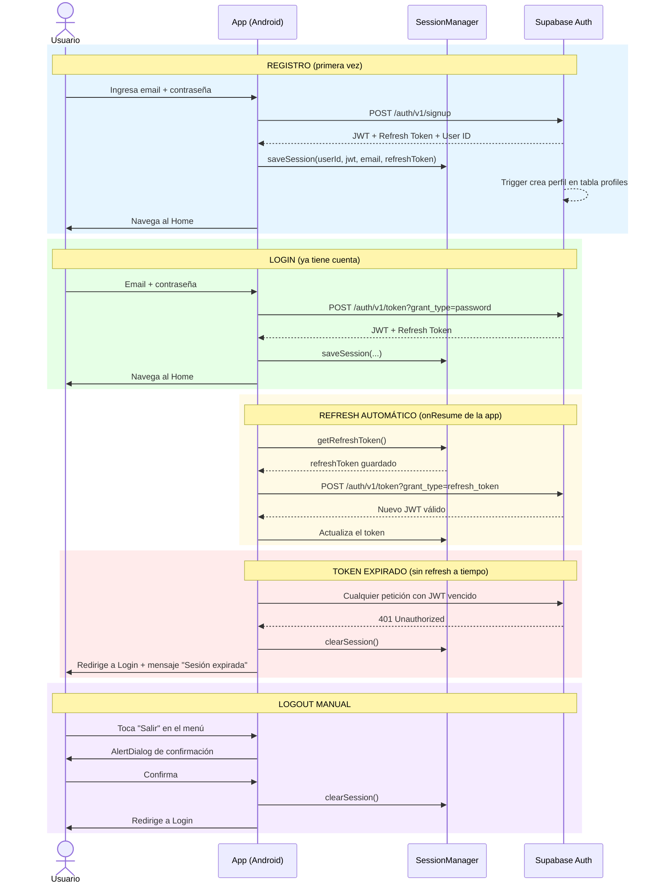

# Diagrama 3 — Flujo de Autenticación

> Muestra cómo funciona el login, el registro, la renovación automática del token y el cierre de sesión.

## Flujo completo



## ¿Qué guarda SessionManager?

```
SharedPreferences "creesh_session"
├── user_id          → UUID del usuario en Supabase
├── token            → JWT actual (expira en ~1 hora)
├── email            → Email del usuario
├── refresh_token    → Para renovar el JWT sin re-loguearse
├── display_name     → Nombre visible del usuario
└── followed_chefs   → IDs de cocineros seguidos (separados por coma)
```

## Seguridad

| Riesgo | Solución implementada |
|---|---|
| Contraseña expuesta | Nunca se almacena — Supabase Auth la maneja |
| Token robado | JWT de corta duración (~1h) + refresh token |
| Inactividad | Timeout de 30 minutos — redirige a Login |
| Acceso no autorizado | Row Level Security en todas las tablas |
| Man-in-the-middle | HTTPS obligatorio en toda la app |
