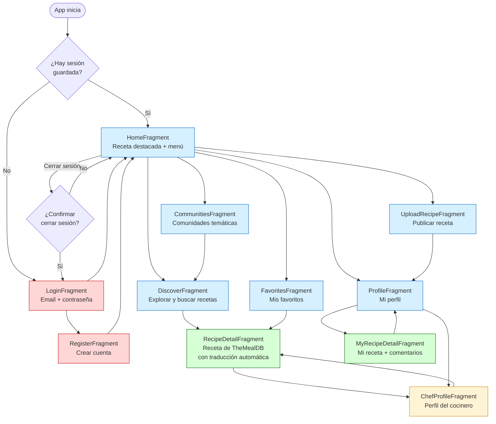

# Diagrama 4 — Navegación entre Pantallas

> Muestra todas las pantallas de la app y cómo el usuario navega entre ellas.

## Mapa de navegación completo



## Leyenda de colores

| Color | Tipo de pantalla |
|---|---|
| Rojo | Autenticación (Login / Registro) |
| Azul | Pantallas principales (barra inferior) |
| Verde | Pantallas de detalle |
| Amarillo | Pantallas sociales (cocineros) |

## Todas las pantallas y su función

| Pantalla | ¿Qué hace? | ¿Cómo se llega? |
|---|---|---|
| `LoginFragment` | Inicio de sesión con email y contraseña | Al abrir la app sin sesión |
| `RegisterFragment` | Crear una cuenta nueva | Desde Login |
| `HomeFragment` | Landing: receta destacada + 4 accesos rápidos | Tras login / barra inferior |
| `DiscoverFragment` | Buscar y explorar recetas por nombre o categoría | Desde Home o Comunidades |
| `RecipeDetailFragment` | Ver receta completa, traducida, con cocinero y botón favorito | Desde Discover o Favoritos |
| `FavoritesFragment` | Ver todas las recetas guardadas con ❤️ | Desde Home o barra inferior |
| `UploadRecipeFragment` | Publicar una receta propia con imágenes e ingredientes | Desde Home |
| `ProfileFragment` | Ver mi perfil: stats, mis recetas, cocineros seguidos | Barra inferior |
| `MyRecipeDetailFragment` | Ver el detalle de mi receta, editar, ver comentarios | Desde Mi Perfil |
| `ChefProfileFragment` | Ver el perfil de un cocinero, seguirlo, ver sus recetas | Desde Detalle de receta o Perfil |
| `CommunitiesFragment` | Lista de comunidades para filtrar recetas por tema | Desde Home |

## Navegación técnica

La app usa **Android Navigation Component** con un único `NavGraph`. Toda la navegación ocurre dentro de `MainActivity` usando un `NavHostFragment`.

```
MainActivity
└── NavHostFragment (contenedor)
    ├── nav_graph.xml (define todas las rutas)
    └── BottomNavigationView (Home, Mi Perfil, Salir)
```
